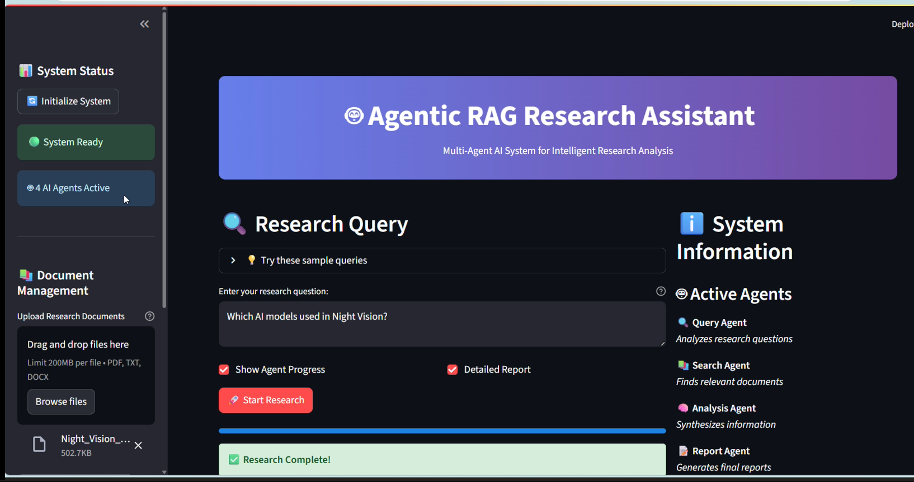

# Agentic-RAG-Powered-AI-Research-Assistant

📚 Agentic RAG Powered AI Research Assistant
A Retrieval-Augmented Generation (RAG) powered intelligent research assistant with agentic capabilities, allowing you to query multiple documents, retrieve precise answers, and automate reasoning workflows.
Built using LangChain, ChromaDB, and Streamlit.

🚀 Features
✅ Document Ingestion – Upload PDFs, text files, or scrape web content.
✅ Vector Store Integration – Uses ChromaDB for semantic search.
✅ HuggingFace Embeddings – High-quality embeddings for better retrieval.
✅ Agentic Capabilities – The assistant can plan, decide, and execute multi-step queries.
✅ Interactive UI – Built with Streamlit.
✅ Local LLM Support – Works with Ollama / LLaMA / Mistral locally.

🛠️ Tech Stack
Python 3.10+

LangChain – Retrieval & agent orchestration

ChromaDB – Vector database

HuggingFace Transformers – Embeddings & models

Ollama / LLaMA – Local model serving

Streamlit – Web-based UI

📂 Project Structure
bash
Copy
Edit
Agentic-RAG-Powered-AI-Research-Assistant/
│
├── app.py                      # Streamlit UI entry point
├── utils/
│   ├── vector_store.py          # ChromaDB vector store logic
│   ├── document_loader.py       # Document ingestion & preprocessing
│   ├── rag_chain.py             # RAG pipeline creation
│   └── agents.py                 # Agentic reasoning logic
├── requirements.txt             # Python dependencies
├── README.md                    # Project documentation
└── data/                        # Sample documents

# 1️⃣ Clone the repo
git clone https://github.com/MansiDakhale/Agentic-RAG-Powered-AI-Research-Assistant.git
cd Agentic-RAG-Powered-AI-Research-Assistant

# 2️⃣ Create and activate virtual environment
python -m venv A_venv
source A_venv/bin/activate   # Mac/Linux
A_venv\Scripts\activate      # Windows

# 3️⃣ Install dependencies
pip install -r requirements.txt

# 4️⃣ (Optional) Install Ollama for local LLM
# https://ollama.ai/download

# Run the Streamlit app
streamlit run app.py

Step 1: Upload your documents in the sidebar.

Step 2: Ask a research question.

Step 3: The assistant retrieves relevant chunks and responds with context.

🧠 How It Works
Document Ingestion → Files are split into chunks using RecursiveCharacterTextSplitter.

Vectorization → Embeddings generated using HuggingFace models.

Vector Store → Stored in ChromaDB for semantic search.

Retrieval-Augmented Generation → Retrieved chunks + user query → passed to LLM.

Agentic Reasoning → For complex queries, the assistant plans multi-step reasoning using LangChain Agents.

📸 Demo Screenshot:

📌 Roadmap
 Add support for multi-modal inputs (images + text).

 Implement memory for persistent conversations.

 Integrate OpenAI GPT-4 for cloud inference.

 Deploy to HuggingFace Spaces / Streamlit Cloud.

🤝 Contributing
Pull requests are welcome! Please fork the repo and submit a PR.

📜 License
This project is licensed under the MIT License.